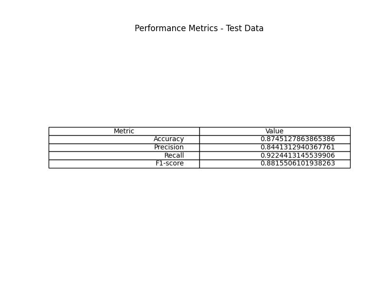
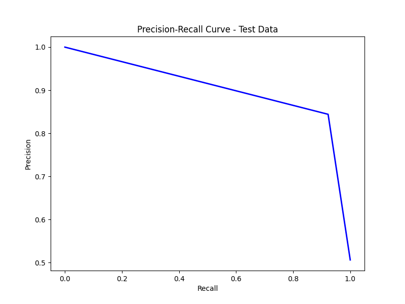
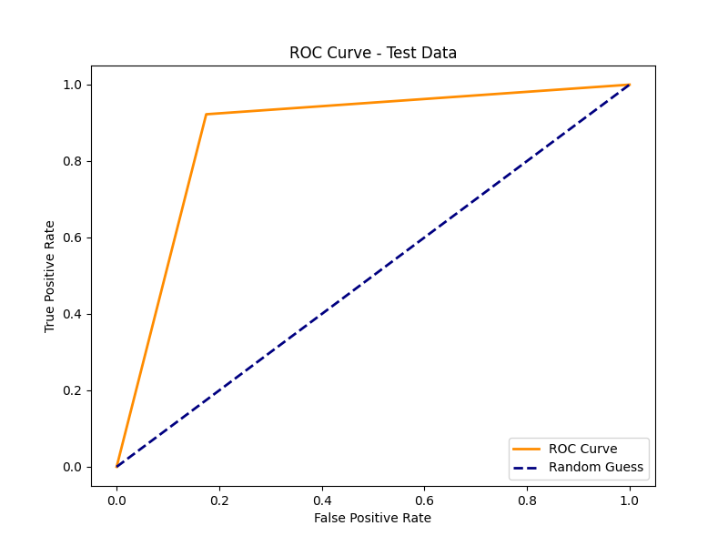

# Fake News Detection Project with BERT

This project implements a fake news detection model using the BERT (Bidirectional Encoder Representations from Transformers) architecture. The steps for training, testing and prediction using the model are described below.

Project Structure
model_creation.py: Script to train the model.
test-model.py: Script to test the model with validation and test data.
prediction.py: Script to make predictions with the trained model.
WELFake_Dataset/: Folder containing training, validation and test data.
model_metrics/: Folder to save model performance metrics in image format.

# Environment Setting
- Clone this repository.
- Install the necessary dependencies:
  
```
pip install -r requirements.txt
````

# Model Training
Model training is performed using the model_creation.py script. This script loads the training data, preprocesses the texts using the BERT tokenizer, obtains the text embeddings and trains a logistic regression model with these embeddings.

# Data base
The model was trained using the [WELFake database](https://zenodo.org/records/4561253) located in the welfake_dataset folder which is separated into three files:
- WELFake_Dataset.csv: Used for model training
- WELFAKE_Valid.csv: Used to validate model training
- WELFAKE_Test.csv: Used for testing the model

# Model Test
Model testing is performed using the test_model.py script. This script loads the test and validation data, preprocesses the texts, obtains the embeddings, makes predictions using the trained model, and evaluates the model's performance.

# Prediction with the Model
To make predictions with the trained model, use the prediction.py script. This script loads a new dataset, pre-processes the texts, obtains the embeddings, makes predictions using the trained model.

# Results
The preliminary results obtained indicate a promising performance of the model in
fake news detection. We observed a high overall accuracy in distinguishing between ver-
false and false, along with an appropriate balance between precision and recall. ROC (Receiver Operating Characteristic) and Precision-Recall curves were also used to evaluate the
model performance at different decision thresholds.
In summary, this study represents a significant contribution to the field of
online disinformation detection. By applying advanced language processing approaches,
natural gem, like BERT, we seek to address the growing challenge of fake news in the era
digital. There are future opportunities to refine and optimize the system to further improve
more effective in detecting fake news.

## Metrics table

## PR Curve

## ROC Curve

